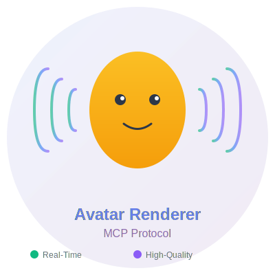
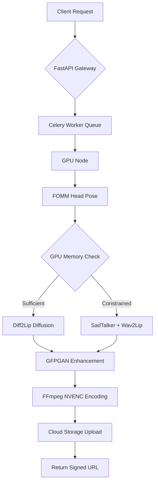

<div align="center">



# Avatar Renderer MCP

[](https://www.python.org/downloads/)
[](LICENSE)
[](https://github.com/psf/black)
[](https://github.com/astral-sh/ruff)
[](https://github.com/astral-sh/uv)

**Production-ready AI-powered talking head generation system with enterprise-grade MCP integration**

[Features](#features) • [Installation](#installation) • [Usage](#usage) • [Quality Modes](#quality-modes) • [Deployment](#deployment) • [Documentation](#documentation)

</div>

---

A high-performance, scalable avatar rendering engine that transforms static images and audio into realistic talking head videos using state-of-the-art deep learning models.

---

## About

Avatar Renderer MCP is a sophisticated video generation system designed for production environments. It combines multiple cutting-edge AI models (FOMM, Diff2Lip, Wav2Lip, SadTalker) to create photorealistic talking avatars from just two inputs:

- 🖼️ **A still image** of a person's face
- 🎤 **An audio file** containing speech

The AI analyzes both inputs and generates a video where the person appears to be speaking naturally, with synchronized lip movements, facial expressions, and head pose animations.

### Key Differentiators

- **Production-Ready Architecture**: Built for enterprise deployments with Kubernetes, Docker, and auto-scaling support
- **MCP Protocol Integration**: Native Model Context Protocol (MCP) support for seamless AI agent communication
- **Intelligent Fallback System**: Automatic GPU memory management with graceful degradation
- **Scalable Design**: Celery-based distributed task processing with KEDA autoscaling
- **Cloud-Native**: Helm charts, Kubernetes manifests, and Terraform configurations included

---

## Features

### Core Capabilities

- ✅ **Dual Quality Modes**: Real-time streaming mode + High-quality content creation mode
- ✅ **Real-Time Rendering**: <3s latency for live news broadcasts and chatbots
- ✅ **High-Quality Output**: FOMM + Diff2Lip + GFPGAN for cinema-grade results
- ✅ **Automatic Mode Selection**: Intelligent pipeline selection based on GPU availability
- ✅ **GPU-Accelerated Encoding**: NVENC H.264 encoding achieving >200 FPS on V100 GPUs
- ✅ **MCP STDIO Server**: Ready for AI agent integration with auto-discovery
- ✅ **RESTful API**: FastAPI-based HTTP interface with comprehensive health checks
- ✅ **Face Enhancement**: Built-in GFPGAN support for improved output quality
- ✅ **Installation Verification**: Automated checks for dependencies and configuration

### DevOps & Infrastructure

- ✅ **Containerized**: Production-grade Dockerfile with CUDA 12.4 support
- ✅ **Kubernetes-Ready**: Helm charts and raw manifests for K8s deployments
- ✅ **Auto-Scaling**: KEDA integration for demand-based pod scaling
- ✅ **CI/CD Pipelines**: Automated testing with GitHub Actions workflows
- ✅ **Health Checks**: Comprehensive `/avatars` endpoint for model status
- ✅ **Installation Verification**: Automated dependency and configuration validation
- ✅ **Monitoring**: Prometheus metrics and structured logging
- ✅ **Cloud Storage**: S3/COS integration for output delivery

---

## Installation

### Prerequisites

- **Python**: 3.11 or 3.12
- **GPU**: NVIDIA GPU with CUDA 12.4+ (optional but recommended)
- **Package Manager**: [uv](https://github.com/astral-sh/uv) (recommended) or pip
- **FFmpeg**: With NVENC support for GPU-accelerated encoding
- **Docker**: (Optional) For containerized deployments

### Quick Start

#### 1. Install uv (Recommended Package Manager)

```bash
# macOS/Linux
curl -LsSf https://astral.sh/uv/install.sh | sh

# Or via pip
pip install uv
```

#### 2. Clone the Repository

```bash
git clone https://github.com/ruslanmv/avatar-renderer-mcp.git
cd avatar-renderer-mcp
```

#### 3. Install Dependencies

```bash
# Install production dependencies
make install

# OR install with development tools
make dev-install
```

#### 4. Verify Installation

```bash
# Run comprehensive installation verification
python scripts/verify_installation.py
```

This will check:
- ✅ Python version compatibility
- ✅ All dependencies installed correctly
- ✅ Module imports working
- ✅ API endpoints configured
- ✅ Quality modes available
- ✅ GPU availability (optional)

#### 5. Download Model Checkpoints

```bash
# Downloads ~3GB of model weights
make download-models
```

#### 6. Run the Server

```bash
# Start FastAPI REST server on http://localhost:8080
make run

# OR start MCP STDIO server
make run-stdio
```

### Manual Installation (Without Make)

```bash
# Create virtual environment with uv
uv venv .venv --python 3.11

# Activate virtual environment
source .venv/bin/activate  # Linux/macOS
.venv\Scripts\activate     # Windows

# Install dependencies
uv pip install -e ".[dev]"

# Run the application
uvicorn app.api:app --host 0.0.0.0 --port 8080 --reload
```

---

## Usage

### REST API Example

```bash
# Submit a rendering job
curl -X POST http://localhost:8080/render \
  -H 'Content-Type: application/json' \
  -d '{
    "avatarPath": "/path/to/avatar.png",
    "audioPath": "/path/to/speech.wav"
  }'

# Response
{
  "jobId": "550e8400-e29b-41d4-a716-446655440000",
  "statusUrl": "/status/550e8400-e29b-41d4-a716-446655440000",
  "async": true
}

# Check job status or download result
curl http://localhost:8080/status/550e8400-e29b-41d4-a716-446655440000
```

### MCP Integration

Register with your MCP Gateway:

```bash
curl -X POST http://gateway:4444/servers \
  -H "Authorization: Bearer $ADMIN_TOKEN" \
  -H "Content-Type: application/json" \
  -d '{
    "name": "avatar-renderer",
    "transport": "stdio",
    "command": "/usr/bin/python3",
    "args": ["/app/mcp_server.py"],
    "autoDiscover": true
  }'
```

The gateway will automatically discover the `render_avatar` tool via `mcp-tool.json`.

### Python API Example

```python
from app.pipeline import render_pipeline

# Real-time mode for live streaming
render_pipeline(
    face_image="avatars/person.jpg",
    audio="audio/speech.wav",
    out_path="output/result.mp4",
    quality_mode="real_time"  # Fast processing for streaming
)

# High-quality mode for YouTube content
render_pipeline(
    face_image="avatars/person.jpg",
    audio="audio/speech.wav",
    out_path="output/result.mp4",
    quality_mode="high_quality"  # Best quality with GFPGAN
)
```

---

## Frontend (Vercel Deployment)

A professional, production-ready **Next.js frontend** is included in the `frontend/` directory, providing a beautiful web UI for the Avatar Renderer MCP service.

### Features

- 🎨 **Futuristic UI** with smooth animations and modern design
- 📤 **File Upload** for avatar images and audio files
- 🎭 **Avatar Gallery** with pre-built avatar options
- 📊 **Real-time Progress** tracking with visual feedback
- 🎬 **Video Preview** with autoplay and download
- 📋 **Copy-to-Clipboard** React embed snippets
- 📱 **Fully Responsive** for all screen sizes
- ⚡ **Optimized for Vercel** deployment

### Quick Start (Frontend)

```bash
# Navigate to frontend directory
cd frontend

# Install dependencies
npm install

# Configure backend URL
cp .env.example .env.local
# Edit .env.local and set NEXT_PUBLIC_AVATAR_API_BASE

# Start development server
npm run dev
```

Open [http://localhost:3000](http://localhost:3000) to see the UI.

### Deploy to Vercel

```bash
cd frontend
vercel
```

Set the environment variable `NEXT_PUBLIC_AVATAR_API_BASE` to your backend URL in the Vercel dashboard.

**Important**: The backend **cannot** run on Vercel (requires GPU + large models). Deploy the backend to a GPU-enabled server (AWS/GCP/Azure VM, RunPod, etc.) and point the frontend to it.

See [frontend/README.md](frontend/README.md) for detailed documentation.

---

## Quality Modes

Avatar Renderer MCP supports **two distinct quality modes** optimized for different use cases:

### 🚀 Real-Time Mode

**Perfect for live streaming, news broadcasts, and interactive chatbots**

- **Speed**: <3 seconds latency (512x512 @ 25fps)
- **Pipeline**: SadTalker + Wav2Lip
- **Bitrate**: 2 Mbps (optimized for streaming)
- **GPU**: Optional (CPU fallback available)
- **Enhancement**: Disabled for speed

**Use Cases:**
- 📺 Live news broadcasts and virtual anchors
- 💬 Real-time AI chatbots and assistants
- 🎥 Live streaming on Twitch/YouTube
- 🎭 Interactive virtual avatars

**Example:**
```bash
curl -X POST http://localhost:8080/render \
  -H 'Content-Type: application/json' \
  -d '{
    "avatarPath": "/path/to/avatar.png",
    "audioPath": "/path/to/speech.wav",
    "qualityMode": "real_time"
  }'
```

### 🎨 High-Quality Mode

**Perfect for YouTube videos, marketing content, and professional productions**

- **Quality**: Maximum with GFPGAN face enhancement
- **Pipeline**: FOMM + Diff2Lip + GFPGAN
- **Bitrate**: 6 Mbps (cinema quality)
- **GPU**: Required (V100 or better recommended)
- **Enhancement**: Full GFPGAN + RealESRGAN

**Use Cases:**
- 🎬 YouTube content and tutorials
- 📢 Marketing and explainer videos
- 🎓 Educational content and courses
- 🎪 Professional virtual influencers

**Example:**
```bash
curl -X POST http://localhost:8080/render \
  -H 'Content-Type: application/json' \
  -d '{
    "avatarPath": "/path/to/avatar.png",
    "audioPath": "/path/to/speech.wav",
    "qualityMode": "high_quality"
  }'
```

### ⚙️ Auto Mode (Default)

Automatically selects the best mode based on:
- GPU availability
- Model checkpoint availability
- System resources

**Comparison Table:**

| Feature | Real-Time | High-Quality |
|---------|-----------|--------------|
| **Speed** | <3s | ~10-30s |
| **GPU Required** | No | Yes |
| **Bitrate** | 2 Mbps | 6 Mbps |
| **Enhancement** | None | GFPGAN |
| **Best For** | Live | Pre-recorded |

📖 **Detailed documentation**: [docs/QUALITY_MODES.md](docs/QUALITY_MODES.md)

---

## Architecture



### Component Overview

| Component | Purpose | Technology |
|-----------|---------|------------|
| **FastAPI** | REST API gateway | Python, uvicorn |
| **MCP Server** | STDIO protocol handler | Python, asyncio |
| **Celery** | Distributed task queue | Redis, RabbitMQ |
| **FOMM** | Head pose generation | PyTorch, CUDA |
| **Diff2Lip** | Diffusion-based lip-sync | Stable Diffusion |
| **SadTalker** | Fallback motion model | 3DMM, PyTorch |
| **Wav2Lip** | Fallback lip-sync GAN | PyTorch |
| **GFPGAN** | Face enhancement | GAN, PyTorch |
| **FFmpeg** | Video encoding | H.264 NVENC |

---

## Configuration

All configuration is managed via environment variables or a `.env` file:

```bash
# General Settings
LOG_LEVEL=INFO
TMP_DIR=/tmp

# GPU Configuration
CUDA_VISIBLE_DEVICES=0
TORCH_USE_INT8=false

# Celery (Optional - leave empty for local mode)
CELERY_BROKER_URL=redis://localhost:6379/0
CELERY_BACKEND_URL=redis://localhost:6379/0
CELERY_CONCURRENCY=1

# Model Paths
MODEL_ROOT=/models
FOMM_CKPT_DIR=/models/fomm
DIFF2LIP_CKPT_DIR=/models/diff2lip
SADTALKER_CKPT_DIR=/models/sadtalker
WAV2LIP_CKPT=/models/wav2lip/wav2lip_gan.pth
GFPGAN_CKPT=/models/gfpgan/GFPGANv1.4.pth

# FFmpeg
FFMPEG_BIN=ffmpeg

# MCP Integration
MCP_ENABLE=true
MCP_TOOL_NAME=avatar_renderer
```

---

## Development

### Setup Development Environment

```bash
# Install all dependencies including dev tools
make dev-install

# Install pre-commit hooks
make pre-commit-install
```

### Code Quality

```bash
# Run linters (ruff, mypy, black)
make lint

# Auto-format code
make format

# Run tests with coverage
make test

# Run all checks
make check
```

### Testing

```bash
# Run all tests
make test

# Run specific test categories
make test-unit          # Unit tests only
make test-integration   # Integration tests only
make test-gpu           # GPU-dependent tests
```

---

## Deployment

### Docker

```bash
# Build Docker image
make docker-build

# Run with GPU support
make docker-run

# Or manually
docker build -t avatar-renderer:latest .
docker run --gpus all -p 8080:8080 \
  -v $(pwd)/models:/models:ro \
  avatar-renderer:latest
```

### Kubernetes / Helm

```bash
# Deploy using Helm
helm upgrade --install avatar-renderer ./charts/avatar-renderer \
  --namespace videogenie \
  --create-namespace \
  --set image.tag=$(git rev-parse --short HEAD) \
  --set resources.limits.nvidia\\.com/gpu=1

# Or use raw manifests
kubectl apply -f k8s/
```

### Auto-Scaling with KEDA

The deployment includes KEDA `ScaledObject` configuration that scales pods based on:

- Kafka message lag
- Redis queue depth
- Custom Prometheus metrics

---

## Performance

| Metric | Value | Hardware |
|--------|-------|----------|
| **FPS (Encoding)** | >200 fps | V100 GPU |
| **Latency (512x512)** | ~2.5s | V100, NVENC |
| **VRAM Usage** | 6-12 GB | Depends on pipeline |
| **CPU Cores** | 2-4 recommended | For preprocessing |
| **Throughput** | 100+ jobs/hour | Single V100 |

---

## Project Structure

```
avatar-renderer-mcp/
├── app/                        # Application source code
│   ├── __init__.py            # Package initialization
│   ├── api.py                 # FastAPI REST endpoints
│   ├── mcp_server.py          # MCP STDIO protocol server
│   ├── pipeline.py            # Core rendering pipeline
│   ├── settings.py            # Configuration management
│   ├── viseme_align.py        # Phoneme-to-viseme alignment
│   └── worker.py              # Celery task worker
├── frontend/                   # Next.js web UI (Vercel-ready)
│   ├── app/                   # Next.js App Router
│   │   ├── page.tsx          # Main page with interactive wizard
│   │   ├── layout.tsx        # Root layout
│   │   └── globals.css       # Global styles + Tailwind
│   ├── public/                # Static assets
│   ├── package.json           # Frontend dependencies
│   ├── next.config.js         # Next.js configuration
│   ├── tailwind.config.js     # Tailwind configuration
│   ├── tsconfig.json          # TypeScript configuration
│   ├── vercel.json            # Vercel deployment config
│   └── README.md              # Frontend documentation
├── tests/                      # Test suite
│   ├── __init__.py
│   ├── conftest.py
│   ├── test_api.py
│   └── test_mcp_stdio.py
├── scripts/                    # Utility scripts
│   ├── benchmark.py
│   └── download_models.sh
├── charts/                     # Helm deployment charts
├── k8s/                        # Raw Kubernetes manifests
├── terraform/                  # Infrastructure as Code
├── docs/                       # Documentation
├── .gitignore                  # Git ignore rules
├── Dockerfile                  # Container definition
├── LICENSE                     # Apache 2.0 license
├── Makefile                    # Build automation
├── pyproject.toml             # Project metadata & dependencies
└── README.md                   # This file
```

---

## Troubleshooting

### Common Issues

| Problem | Solution |
|---------|----------|
| `CUDA out of memory` | Reduce Diff2Lip steps or use Wav2Lip fallback |
| `Green/black artifacts` | Update NVIDIA drivers (≥545), check FFmpeg NVENC support |
| `Lips drift from audio` | Check phoneme alignment, resample audio to 16kHz |
| `Models not found` | Run `make download-models` |
| `uv not found` | Install uv: `curl -LsSf https://astral.sh/uv/install.sh \| sh` |

### Debug Mode

```bash
# Enable debug logging
export LOG_LEVEL=DEBUG

# Run with verbose output
make run
```

---

## Roadmap

- [ ] WebRTC streaming support for real-time rendering
- [ ] Incremental synthesis for low-latency applications
- [ ] Multi-language phoneme support
- [ ] Advanced emotion control
- [ ] Cloud-native TTS integration
- [ ] Multi-GPU distributed rendering

---

## Contributing

Contributions are welcome! Please follow these guidelines:

1. Fork the repository
2. Create a feature branch (`git checkout -b feature/amazing-feature`)
3. Commit your changes (`git commit -m 'Add amazing feature'`)
4. Push to the branch (`git push origin feature/amazing-feature`)
5. Open a Pull Request

Ensure all tests pass and code follows PEP 8 standards:

```bash
make check
```

---

## License

This project is licensed under the **Apache License 2.0** - see the [LICENSE](LICENSE) file for details.

```
Copyright 2025 Ruslan Magana Vsevolodovna

Licensed under the Apache License, Version 2.0 (the "License");
you may not use this file except in compliance with the License.
You may obtain a copy of the License at

    http://www.apache.org/licenses/LICENSE-2.0

Unless required by applicable law or agreed to in writing, software
distributed under the License is distributed on an "AS IS" BASIS,
WITHOUT WARRANTIES OR CONDITIONS OF ANY KIND, either express or implied.
See the License for the specific language governing permissions and
limitations under the License.
```

---

## Author

**Ruslan Magana Vsevolodovna**

- 🌐 Website: [ruslanmv.com](https://ruslanmv.com)
- 📧 Email: contact@ruslanmv.com
- 💼 GitHub: [@ruslanmv](https://github.com/ruslanmv)

---

## Acknowledgments

This project builds upon the work of several research teams:

- **FOMM** (First Order Motion Model) - [Aliaksandr Siarohin et al., NeurIPS 2020](https://github.com/AliaksandrSiarohin/first-order-model)
- **Diff2Lip** - Diffusion-based lip synchronization research
- **SadTalker** - [Zhang et al., CVPR 2023](https://github.com/OpenTalker/SadTalker)
- **Wav2Lip** - [K R Prajwal et al., ACM MM 2020](https://github.com/Rudrabha/Wav2Lip)
- **GFPGAN** - [Tencent ARC Lab, 2021](https://github.com/TencentARC/GFPGAN)

Special thanks to the open-source AI community for advancing the state of the art in generative models.

---

## Support

For issues, questions, or feature requests, please:

1. Check the [Troubleshooting](#troubleshooting) section
2. Search [existing issues](https://github.com/ruslanmv/avatar-renderer-mcp/issues)
3. Open a [new issue](https://github.com/ruslanmv/avatar-renderer-mcp/issues/new) with detailed information

For commercial support or consulting inquiries, contact: **contact@ruslanmv.com**

---

<div align="center">
  <strong>Made with ❤️ by <a href="https://ruslanmv.com">Ruslan Magana Vsevolodovna</a></strong>
  <br>
  <sub>Transforming still images into lifelike talking avatars</sub>
</div>
