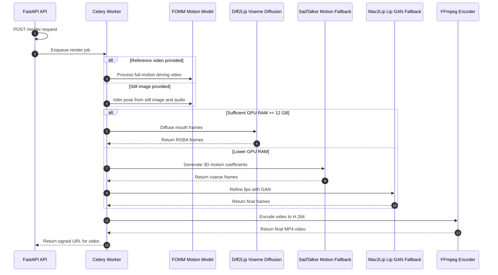

# 🤖 Generative MCP Avatar Renderer

> A high-quality generative engine that creates talking avatars from a single image and an audio file.
> Built for scalable deployments, this renderer natively integrates via the MCP protocol, enabling seamless, auto-discovered tooling in a distributed system.

[]()
[]()

---

This project is an AI Talking Head Generator, a tool that uses artificial intelligence to create a video of a person speaking from two simple inputs:

🖼️ A still image of a person's face.

🎤 An audio file of speech.

The AI analyzes both inputs and then generates a new video, animating the person's mouth, lips, and subtle facial expressions to realistically match the words and timing of the voice recording. The result makes it appear as if the person in the static photo is actually speaking.

## 🚀 Features

* **FOMM (head pose)** + **Diff2Lip (diffusion visemes)** with automatic fallback to **SadTalker (+ Wav2Lip)** when VRAM is tight.  
* **MCP STDIO server** *and* FastAPI REST façade live in the same container.  
* CUDA 12.4 + PyTorch 2.3; NVENC H.264 encodes > 200 fps on a V100.  
* Pluggable pipeline (`pipeline.py`) – swap in AnimateDiff, DreamTalk, LIAON‑LipSync, etc.  
* Helm chart & raw manifests request **`nvidia.com/gpu: 1`** and tolerate the **`dedicated=gpu`** taint.  
* KEDA‑ready: ScaledObject samples Kafka lag and spins 0 → N render pods as demand changes.  
* Full CI (CPU‑only) plus Colab notebooks for checkpoint tuning.

---

## 📦 Project tree

```text
avatar-renderer-pod/
├── README.md                    # You are here
├── LICENSE                      # Apache‑2.0
│
├── app/                         # Runtime code
│   ├── api.py                   # FastAPI → Celery task
│   ├── mcp_server.py            # STDIO MCP server (render_avatar)
│   ├── worker.py                # Celery worker bootstrap
│   ├── pipeline.py              # FOMM+Diff2Lip → FFmpeg glue
│   ├── viseme_align.py          # Montreal Forced Aligner helper
│   └── settings.py              # Pydantic env config
│
├── models/                      # 🔹 **not tracked** – mount at runtime
│   ├── fomm/                    # `vox-cpk.pth` – FOMM (Aliaksandr Siarohin, 2020)
│   ├── diff2lip/                # `Diff2Lip.pth` – diffusion visemes (Yuan Gary, 2024)
│   ├── sadtalker/               # `sadtalker.pth` – SadTalker motion (Zhang et al., CVPR 2023)
│   ├── wav2lip/                 # `wav2lip_gan.pth` – lip GAN (K Rudrabha, 2020)
│   └── gfpgan/                  # `GFPGANv1.3.pth` – face enhancer (Tencent ARC, 2021)
│
├── Dockerfile                   # CUDA 12.4 runtime image
├── requirements.txt             # torch, diffusers, fastapi, celery …
│
├── charts/                      # Helm deployment & service
│   └── avatar-renderer/
│       └── values.yaml
│
├── k8s/                         # Raw YAML (if Helm not used)
│   ├── deployment.yaml
│   ├── service.yaml
│   └── autoscale.yaml
│
├── mcp-tool.json                # Manifest auto‑discovered by Gateway
│
├── ci/
│   ├── github-actions.yml       # lint → build → test → push
│   └── tekton-build.yaml
│
├── notebooks/                   # Colab/Jupyter demos & fine‑tune
│   ├── 01_fomm_diff2lip_demo.ipynb
│   └── 02_finetune_diff2lip.ipynb
│
├── scripts/                     # Utility helpers
│   ├── download_models.sh       # Fetch all checkpoints (≈ 3 GB)
│   ├── benchmark.py             # FPS & latency profiler
│   └── healthcheck.sh           # Curl‑based liveness probe
│
├── tests/                       # pytest (CPU) smoke ≤ 5 s
│   ├── conftest.py
│   ├── test_render_api.py
│   ├── test_mcp_stdio.py
│   └── assets/ {alice.png, hello.wav}
│
└── docs/
    ├── 00_overview.md
    └── 02_mcp_integration.md
````

---

## 🖼 Render workflow (detailed)



* **FOMM** or **SadTalker** provides realistic head pose, eye‑blink and basic expression.
* **Diff2Lip** (Stable Diffusion in‑painting) improves lip realism; falls back to **Wav2Lip** when VRAM is scarce.
* Final MP4 is encoded with `-profile:v high -preset p7 -b:v 6M` for presentation‑ready quality.

---

## 🛠 Local quick‑start (GPU workstation)

```bash
# 1. Clone & pull weights (≈ 3 GB, once)
bash scripts/download_models.sh

# 2. Build & run
docker build -t avatar-renderer:dev .
docker run --gpus all -p 8080:8080 \
  -v $(pwd)/models:/models avatar-renderer:dev &

# 3. Render
curl -X POST localhost:8080/render \
  -H 'Content-Type: application/json' \
  -d '{"avatarId":"alice","voiceUrl":"https://example.com/hello.wav"}'
```

---

## 🔗 MCP integration

```bash
curl -X POST http://gateway:4444/servers \
 -H "Authorization: Bearer $ADMIN_TOKEN" \
 -H "Content-Type: application/json" \
 -d '{
   "name": "avatar-renderer",
   "transport": "stdio",
   "command": "/usr/bin/python3",
   "args": ["/app/mcp_server.py"],
   "autoDiscover": true
 }'
```

Gateway detects `mcp-tool.json` and registers the **`render_avatar`** tool automatically.

---

## 🚦 Feature compliance matrix

| Feature                                     | Status  | Notes                                              |
| ------------------------------------------- | ------- | -------------------------------------------------- |
| Realistic facial animation from still image | **✅**   | FOMM / SadTalker for full head + expressions       |
| High‑fidelity lip‑sync                      | **✅**   | Diff2Lip diffusion visemes or Wav2Lip GAN fallback |
| MP4 export (presentation‑ready)             | **✅**   | H.264 NVENC, signed COS/S3 URL                     |
| Live WebRTC streaming                       | ⚠️ Soon | GStreamer NVENC RTP branch in `feature/webrtc`     |
| AI‑agent integration (MCP)                  | **✅**   | STDIO protocol ready, REST remains for demos       |
| Low‑latency incremental synthesis           | ⚠️ R\&D | Needs chunked TTS + sliding‑window Diff2Lip        |

---

## ⚙ Helm deployment (OpenShift)

```bash
helm upgrade --install avatar-renderer charts/avatar-renderer \
  --namespace videogenie --create-namespace \
  --set image.tag=$(git rev-parse --short HEAD)
```

Requests **1 GPU**, 6 GiB RAM, 2 vCPU. The existing VideoGenie KEDA ScaledObject will autoscale pods based on Kafka lag.


# Makefile Guide

```bash
# first‑time developer workflow
make setup
make download-models
make run        # REST server → http://localhost:8080/render

# MCP stdio test
make run-stdio  # then echo '{"tool":"render_avatar", ...}' | ./app/mcp_server.py

# build + run container
make docker-build
make docker-run
```

---

## 🐛 Troubleshooting

| Symptom                                 | Fix / Hint                                                         |
| --------------------------------------- | ------------------------------------------------------------------ |
| `CUDA error: out of memory`             | Reduce `--diff2lip_steps`, enable Wav2Lip fallback, or upgrade GPU |
| Stuck at “Align visemes …”              | Ensure M.F. Aligner English model in `models/mfa/`                 |
| Green / black artefacts in output video | Driver ≥ 545, verify FFmpeg built with `--enable-nvenc`            |
| Lips drift from audio by > 100 ms       | Check `viseme_align.py` phoneme timing; re‑sample audio 16 kHz     |

---

## 📜 License

Apache 2.0 — use it, fork it, break it, fix it, **PR back** 🙌

