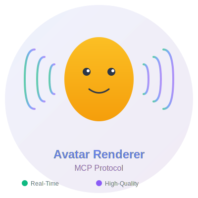
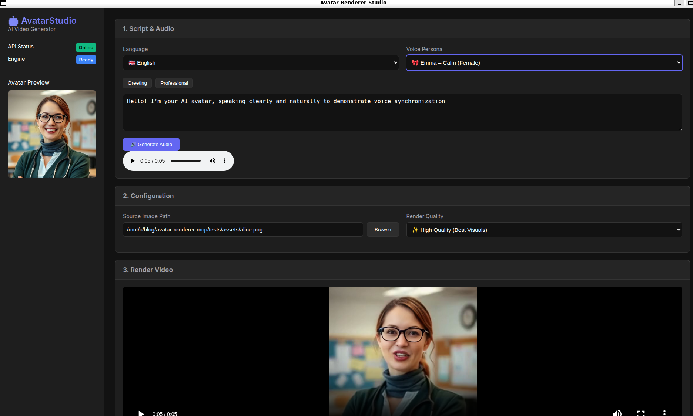
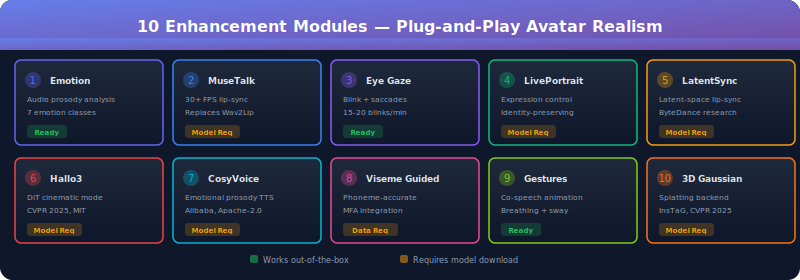

<div align="center">



# Avatar Renderer MCP

### Turn any photo into a talking AI avatar

[](https://www.python.org/downloads/)
[](LICENSE)
[](#testing)

**One image. One audio clip. One realistic talking video.**

[Get Started](#get-started) · [How It Works](#how-it-works) · [Use Cases](#use-cases) · [Enterprise](#enterprise-ready) · [Docs](docs/)

</div>

---

## What is Avatar Renderer MCP?

Give it a **photo** and an **audio file** — it generates a video where the person speaks naturally, with synchronized lip movements, facial expressions, eye blinks, and body language.

No 3D modeling. No motion capture. No video editing. Just AI.



---

## Why Avatar Renderer MCP?

| | Traditional Video | Stock Avatars | **Avatar Renderer MCP** |
|---|---|---|---|
| **Setup time** | Hours/days | Minutes | Seconds |
| **Cost per video** | $50-500+ | $5-20 | Near zero |
| **Custom faces** | Requires actors | Generic | Any photo |
| **Languages** | Re-record | Limited | 23 languages built-in |
| **Expressions** | Manual | Robotic | AI-driven emotions |
| **Scale** | 1 at a time | Limited | Batch + queue, GPU-bound |

---

## Use Cases

**Content Creators** — Generate YouTube explainers, course lectures, and social media content using your own face without sitting in front of a camera.

**Enterprise & Marketing** — Produce multilingual product demos, training videos, and internal communications at scale. One photo, unlimited videos.

**News & Broadcasting** — Power virtual anchors and live news presenters with low-latency real-time rendering.

**Education** — Create personalized tutoring avatars that explain concepts in any of 23 supported languages.

**Customer Experience** — Build interactive AI assistants and chatbots with a human face for customer support, onboarding, and engagement.

**Game & Entertainment** — Animate NPCs, virtual influencers, and digital humans for games, VR, and immersive experiences.

---

## How It Works


Three simple steps:

1. **Upload** a portrait photo (any face, any angle)
2. **Provide** audio — record your own, type text for AI speech, or upload a file
3. **Render** — the AI handles lip-sync, expressions, eye movement, and body language

The system automatically picks the best rendering pipeline for your hardware and use case.

---

## Two Rendering Modes

| | Real-Time | High-Quality |
|---|---|---|
| **Speed** | Under 3 seconds | 10-30 seconds |
| **Best for** | Live streaming, chatbots | YouTube, marketing, courses |
| **GPU required** | No (CPU works) | Yes |
| **Output quality** | Great | Cinema-grade |

The **Auto** mode (default) picks the right one for you.

---

## Generation Methods — Quality Comparison

All variants generated from the **same portrait + same text** on the live
[ZeroGPU Space](https://huggingface.co/spaces/ruslanmv/avatar-renderer). Samples
hosted on the [comparison dataset](https://huggingface.co/datasets/ruslanmv/avatar-renderer-samples).

The Wav2Lip engine is the **faithful dev-v0.1.25 full-face pipeline**: the whole
predicted face crop is pasted back each frame and restored with GFPGAN per-frame
(no mouth-only blend) — the most natural mouth. The `wav2lip_band` column is the
alternative anti-flicker compositing (mouth band on a static base).

| `simple` | `wav2lip` | `wav2lip_gfpgan` ⭐ | `wav2lip_band` | `fullface` |
|:---:|:---:|:---:|:---:|:---:|
|  |  |  |  |  |
| No lip-sync (static) | Full-face, no restore | Full-face + GFPGAN | Mouth-band, static base | + head motion, static bg |
| [mp4](https://huggingface.co/datasets/ruslanmv/avatar-renderer-samples/resolve/main/simple.mp4) | [mp4](https://huggingface.co/datasets/ruslanmv/avatar-renderer-samples/resolve/main/wav2lip.mp4) | [mp4](https://huggingface.co/datasets/ruslanmv/avatar-renderer-samples/resolve/main/wav2lip_gfpgan.mp4) | [mp4](https://huggingface.co/datasets/ruslanmv/avatar-renderer-samples/resolve/main/wav2lip_band.mp4) | [mp4](https://huggingface.co/datasets/ruslanmv/avatar-renderer-samples/resolve/main/fullface.mp4) |

**Objective metrics** (measured on the rendered frames, ZeroGPU A10G):

| Method | Mouth sharpness ↑ | Lip motion ↑ | Face flicker ↓ | Background motion ↓ |
|---|---:|---:|---:|---:|
| `simple` | 108.0 | 0.0 (no talk) | 0.00 | 0.00 |
| `wav2lip` | 12.9 (blurry) | 4.99 | 1.44 | 0.00 |
| **`wav2lip_gfpgan`** ⭐ | **45.4** | 5.13 | 1.81 | 0.00 |
| `wav2lip_band` | 37.6 | 4.89 | **0.05** | 0.00 |
| `fullface` | 27.6 | 5.02 | 0.85 (head motion) | 0.07 |

**Verdict**
- 🏆 **`wav2lip_gfpgan` — best overall (restored original):** faithful dev-v0.1.25 full-face pipeline — the most natural, sharp talking mouth (≈3.5× sharper than raw Wav2Lip), untouched background. The default for `standard`/`high_quality`.
- **`wav2lip_band` — steadiest:** mouth-band blend on a GFPGAN'd static base, so the face barely flickers (0.05) at a small cost in mouth realism. Good for very still presenter shots.
- **`fullface` — most lifelike motion:** adds subtle head motion + blink while keeping the **background static**; slightly softer due to the head warp. Used by `premium`.
- `wav2lip` alone is too blurry (no restoration); `simple` has no lip-sync (preview only).

> Trade-off: the full-face pipeline (`wav2lip_gfpgan`) GFPGANs every frame, so it
> shows a little more frame-to-frame face variation than the static-base
> `wav2lip_band` — that's the price of the more natural, original-quality mouth.
> Naturalness ceiling: all methods animate the mouth (+ head, for `fullface`).
> True 3D head-pose & expression (SadTalker/LivePortrait) is the recommended next
> tier — see [`docs/NATURALNESS_DESIGN.md`](docs/NATURALNESS_DESIGN.md).

### Premium engines (MuseTalk · LatentSync · Diff2Lip) on a Colab GPU

The premium engines can't run on the ZeroGPU Space (it only GPU-accelerates
in-process code; these run as subprocesses needing their own repos + weights).
Run them on a **real** Colab GPU instead:

[](https://colab.research.google.com/github/ruslanmv/avatar-renderer-mcp/blob/main/demo_colab_premium.ipynb)
&nbsp;`demo_colab_premium.ipynb`

It installs MuseTalk/Diff2Lip/FOMM (+ optional LatentSync), then renders through the
same `orchestrate()` engine selector used in production. **Free T4** runs
MuseTalk + Diff2Lip + Wav2Lip; **LatentSync** needs an A100/L4 (Colab Pro).
See [`COLAB_SETUP.md`](COLAB_SETUP.md).

---

## 10 Enhancement Modules



What makes avatars look **alive** instead of robotic:

| Enhancement | What it does | Needs setup? |
|---|---|---|
| **Emotion Detection** | Reads audio tone to drive happy, sad, surprised expressions | No |
| **Eye Gaze & Blink** | Natural blink patterns and subtle eye movements | No |
| **Body Gestures** | Breathing, shoulder sway, and speech-synced motion | No |
| **MuseTalk Lip-Sync** | Next-gen lip-sync at 30+ FPS | Model download |
| **LivePortrait** | Fine-grained expression control | Model download |
| **LatentSync** | Sharper lip movements via latent-space AI | Model download |
| **Hallo3 Cinematic** | Hollywood-quality rendering (CVPR 2025) | Model download |
| **CosyVoice TTS** | Emotion-matching voice synthesis in 23 languages | Server setup |
| **Viseme Guided** | Phonetically accurate mouth shapes | Data input |
| **3D Gaussian Splatting** | Next-gen 3D avatar rendering | Model download |

The first three work **immediately** with zero configuration.

---

## Get Started

### Option A: One-Command Install

```bash
git clone https://github.com/ruslanmv/avatar-renderer-mcp.git
cd avatar-renderer-mcp
make install
```

### Option B: Desktop App

```bash
make launch
```

Opens a visual studio with text-to-speech, avatar selection, and one-click rendering.

### Option C: API Server

```bash
make run
```

Starts a REST API at `http://localhost:8080`. Send a photo and audio, get a video back.

```bash
curl -X POST http://localhost:8080/render \
  -H 'Content-Type: application/json' \
  -d '{"avatarPath": "photo.png", "audioPath": "speech.wav"}'
```

### Option D: AI Agent Integration (MCP)

Built-in [Model Context Protocol](https://modelcontextprotocol.io/) support. AI agents can call the `render_avatar` tool directly:

```bash
make run-stdio
```

---

## Built-in Text-to-Speech

Don't have audio? Just type text. The built-in Chatterbox TTS engine generates natural speech in **23 languages**:

Arabic, Chinese, Danish, Dutch, English, Finnish, French, German, Greek, Hebrew, Hindi, Italian, Japanese, Korean, Malay, Norwegian, Polish, Portuguese, Russian, Spanish, Swedish, Swahili, Turkish

Choose from multiple voice profiles (female, male, neutral) with adjustable speed and tone.

---

## Enterprise Ready

Built for production from day one:

- **Docker** — GPU-ready container with CUDA 12.4
- **Kubernetes** — Helm charts and manifests included
- **Auto-Scaling** — KEDA-based scaling on demand
- **Distributed Processing** — Celery task queue with Redis/RabbitMQ
- **Cloud Storage** — S3/COS integration for output delivery
- **Health Monitoring** — Prometheus metrics and structured logging
- **CI/CD** — GitHub Actions with 107 automated tests

```bash
# Docker
docker run --gpus all -p 8080:8080 avatar-renderer:latest

# Kubernetes
helm upgrade --install avatar-renderer ./charts/avatar-renderer
```

---

## Frontend

A modern **Next.js** web UI is included for browser-based access:

```bash
cd frontend && npm install && npm run dev
```

Deploy to **Vercel** with one command. Point it at your GPU backend.

---

## Performance

Figures below are **targets on a modern data-center GPU** (e.g. NVIDIA T4 / A10G)
for short clips; actual latency and throughput depend on clip length, resolution,
enabled enhancements, and hardware. Run `python scripts/benchmark.py` to measure
your own environment.

| Metric | Target (GPU) |
|---|---|
| Rendering latency (real-time mode) | ~1–3 s for short clips |
| Rendering latency (high-quality) | ~10–30 s |
| Throughput | Tens of videos/hour per GPU (clip-length dependent) |
| Supported languages | 23 |
| Enhancement modules | 10 |

---

## Documentation

| Document | Description |
|---|---|
| [ENHANCEMENTS.md](docs/ENHANCEMENTS.md) | All 10 enhancement modules — usage, API, and custom extensions |
| [QUALITY_MODES.md](docs/QUALITY_MODES.md) | Rendering modes comparison and configuration |
| [SETUP_GUIDE.md](docs/SETUP_GUIDE.md) | Detailed installation and setup instructions |
| [TROUBLESHOOTING.md](docs/TROUBLESHOOTING.md) | Common issues and solutions |
| [AVATAR_IMPROVEMENTS_ANALYSIS.md](docs/AVATAR_IMPROVEMENTS_ANALYSIS.md) | Technical research and architecture decisions |

---

## Testing

```bash
# Full test suite
make test

# Quick enhancement tests (no GPU needed, runs in <1s)
python -m pytest tests/test_enhancements.py -v
```

The full suite (107 tests) runs in CI on every push — no GPU or model downloads required.

---

## Roadmap

- [x] 10 enhancement modules for lifelike avatars
- [x] 23-language text-to-speech
- [x] Desktop app with visual studio
- [x] CI/CD with automated testing
- [ ] WebRTC real-time streaming
- [ ] Multi-GPU distributed rendering
- [ ] 3D Gaussian Splatting production pipeline

---

## Contributing

1. Fork the repository
2. Create a feature branch
3. Make your changes and run `make test`
4. Open a Pull Request

---

## License

[Apache License 2.0](LICENSE) — free for personal and commercial use.

---

## Author

**Ruslan Magana Vsevolodovna**

[Website](https://ruslanmv.com) · [GitHub](https://github.com/ruslanmv) · [Email](mailto:contact@ruslanmv.com)

---

## Acknowledgments

Built on the shoulders of outstanding open-source research:

[FOMM](https://github.com/AliaksandrSiarohin/first-order-model) · [SadTalker](https://github.com/OpenTalker/SadTalker) · [Wav2Lip](https://github.com/Rudrabha/Wav2Lip) · [Diff2Lip](https://github.com/soumik-kanad/diff2lip) · [GFPGAN](https://github.com/TencentARC/GFPGAN) · [LivePortrait](https://github.com/KwaiVGI/LivePortrait) · [MuseTalk](https://github.com/TMElyralab/MuseTalk) · [LatentSync](https://github.com/bytedance/LatentSync) · [Hallo3](https://github.com/fudan-generative-vision/hallo3) · [CosyVoice](https://github.com/FunAudioLLM/CosyVoice) · [Audio2Face](https://github.com/NVIDIA/Audio2Face-3D)

---

<div align="center">
  <strong>Made with care by <a href="https://ruslanmv.com">Ruslan Magana Vsevolodovna</a></strong>
  <br><br>
  <sub>One photo. One voice. Infinite possibilities.</sub>
</div>
